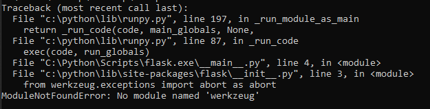
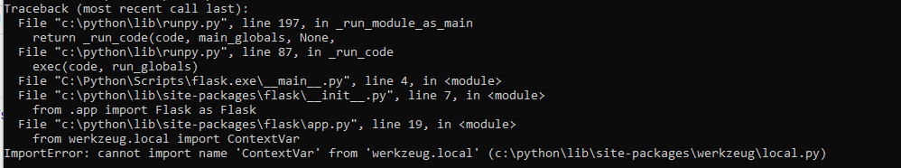
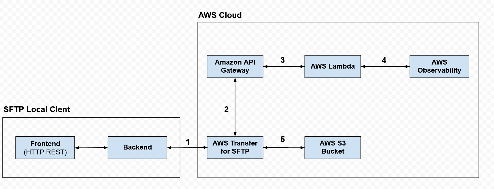

# Overview

Bundle Up! is a Python-based upload portal that allows clients to conveniently submit diagnostic bundles (.tgz only) with the relevant configs & logs. 

The decision was made to create this project with Python 3.9.1 & Flask 2.0.1 due to the dynamic libraries available in Python, as well as the ease of use of the Flask framework for implementing and maintaining a web server. 

While this was more of a preference than a requirement, there are limited better options in terms of simplicity and overall value of performance. 

## Installation & Setup

The main program is bundleup.py, while the included uploader tool was intended to be merged into the original program once functionality was confirmed. However, due to time constraints, limitations of execution and other factors, this was not possible and as such is being submitted as a separate, but related program. 

This project is built on a Flask, a simple but extensible microframework that provides robust API support, rapid scalability, and easy functionality. [Flask Documentation] https://flask.palletsprojects.com/en/2.0.x/installation/

A virtual environment should be created to manage the dependencies of the project in both development and production. This ensures that Python libraries will not mix versions and therefore break environment compatability. 
Use the included **venv** module to create virtual environments: 

```bash
$ mkdir myproject
$ cd myproject
$ python3 -m venv venv
```

Then be sure to activate the corresponding environment:

```bash
$ . venv/bin/activate
```

The shell will then update to show the name of the activated environment. After activation, use the following command to install Flask via pip:

```bash
$ pip install Flask
```

After the installation is complete, use the flask command to run the application: 

```bash
$ flask run
```

If installed and setup correctly, your terminal should show the app running: 

```bash
 * Running on http://127.0.0.1:5000/
```

You should now be able to navigate to http://127.0.0.1:5000/ and view the app.

## Context

This program was completed within the specified period of time that was available to dedicate to staging, preparations, and planning to build an effective solution to the problem. Due to this limitation, the focus was to deliver a workable product that satisfied all of the necessary requirements, while being as streamlined and as intuitive as possible. 

The use of Flask was beneficial in the sense that it provides several libraries that include the functionality that was required: flash_render_template, request and jsonify were all integral components of having a working model in both code and forward stratefy. 

Assuming no environment conflicts, the program runs and satisfies all of the mandatory requirements as followed:

- Customer interface is HTTP REST API (optional) **completed**
- Customer must be able to upload very large files (required) **completed**
- Program must only accept .tgz files (required) **completed**
- Must be able to handle multiple requests concurrently (required) **completed**
- Support team must be able to list and download any uploaded files (required) **started,unfinished**
- Must not use any pre-built file upload libraries **completed**
- Minimize number of external dependencies in business logic code path **completed**
- Setup observability solution with the design goal of providing monitoring & troubleshooting capabilities **ran out of time, suggestions included**
- Setup deployment of application to AWS **started,unfinished**

## Reflections & Observations  

The biggest issue during development was figuring out how to properly interface the custom file upload service with AWS such that the program returned no errors, and all data was properly transmitted from point A to point B and back. A better decision instead of attempting to make use of Flask & the Werkzeug library, the program could have been created using Django & a WSGI server such as Gunuicorn. 

In retrospect, this would have saved a ton of debugging time as even after rolling back to Werkzeug 0.0.16 from 1.0, completely uninstalling all versions, and then reinstalling again; still yielded the same issues in which the Werkzeug module could not be found. For clarification, even after a complete uninstall, emptying of the cache, and verifying that no instance of Werkzeug exist, the errors shown below persisted. 



Through numerous attempts to rectify and debug this issue, time expired before a true solution was reached, so a workaround of not using this library in the future is necessary. 



Regardless of the approach, this error would not go away, and as such, picking an easier toolset to work with would have paid dividends in terms of overall efficiency and delivering a complete solution to the problem. 

## Improvement Opportunities 

With enough availability to work on this project, the following enhancements can be created in a short period of time: 

- User intuitive UI & UX 
- More effecient filetype validation checks 
- Larger upload concurrency & total capacity 
- OAuth2.0 Authorization & Authentication (OIDConnect) 
- Full-scale CRUD-based CI/CD pipeline to AWS, GCP & any other hybrid cloud environments 

## Roadmap & Observability Recommendation

Observability by definition is the contextualization and meaningful insight that comes from logs, metrics and traces. 

While time expired before this stage could be fully erected and configured, the data flow map below illustrates a very basic layout of the application itself, as well as its integration with AWS and the numerous observability tools: CloudWatch, Lambda, and X-Ray

The SFTP local client would serve as the interface point for the customer to upload the necessary archives securely and concurrently. The frontend would work with the back end, which would then communicate directly to AWS Cloud via the appropriate API calls. Once the data/files made it to the appropriate datastores on the S3 bucket; the observability layer would kick in for each instance. 

Here are the advantages as to why each tool should be used for AWS monitoring & observability: 

**CloudWatch** 
- Includes preconfigured monitoring packages & metrics for easy setup and quick ease of use
- Alert system covers most AWS resources in a granular fashion
- Extended features for monitoring individual AWS components (detailed monitoring, graph metrics, etc.) 

**Lambda**
- Built to support rapid and continuous horizontal scaling, so we can support our application as it gets more complex and workloads increase 
- Easy to develop, run and manage application functionalities without added infrastructure complexity 
- Subsecond metering is a good feature to have to keep compute time consumed limited as it grows  

**X-Ray**
- Powerful tool that allows us to quantify the customer impact applications built with serverless architecture have 
- Collects and records traces to use for deeper insights and root cause analysis 
- Service map shows trace data such as latencies, HTTP status and metadata for each service

All of these tools combined would make for a highly effective tool kit that would solve the original problem, while also applying the necessary monitoring and troubleshooting capacities that are needed, depending on our business case and further prudent context. With ample time, a deeper analysis could be conducted into the potential benefits of running microservices, containers, and various other performance optimizing efforts. This would also open up the possibility of introducing either semi-scale or full-scale automation, depending on the limitations, context, and project budget. 



## Credits
A special thanks to all of the brilliant documentation available and open forums relevant to the completion of this project from sources such as: 
Python, Flask, CORS, and StackOverflow.

Pull requests are welcome. For major changes, please open an issue first to discuss what you would like to change.
Please make sure to update tests as appropriate.

## License
You are free to use this program under the MIT free use license
[MIT](https://choosealicense.com/licenses/mit/)
